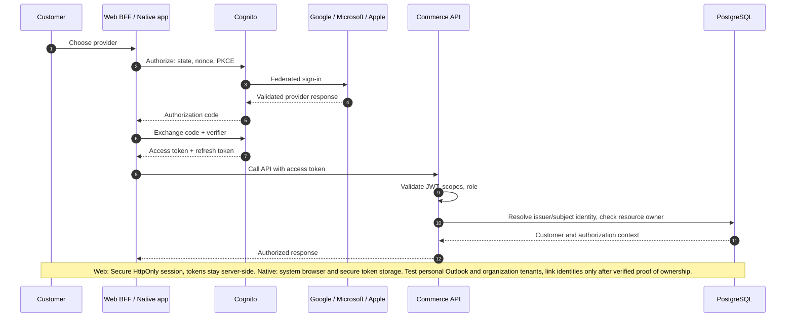
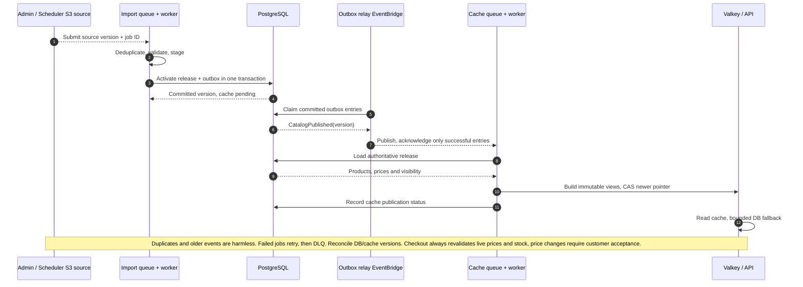
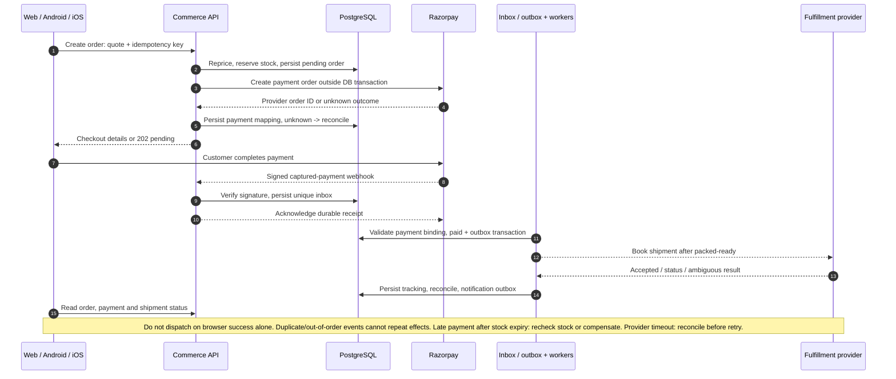
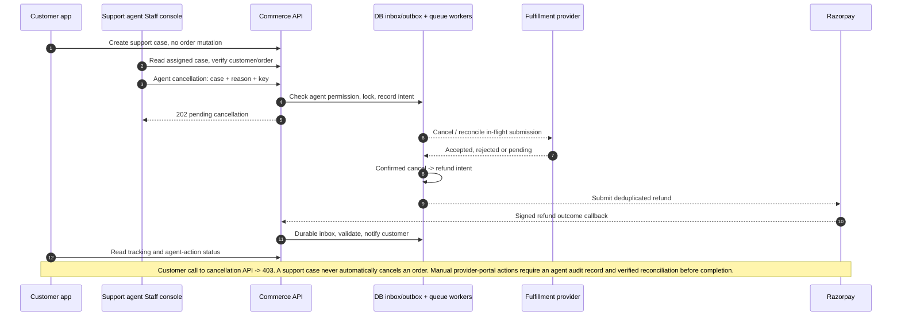
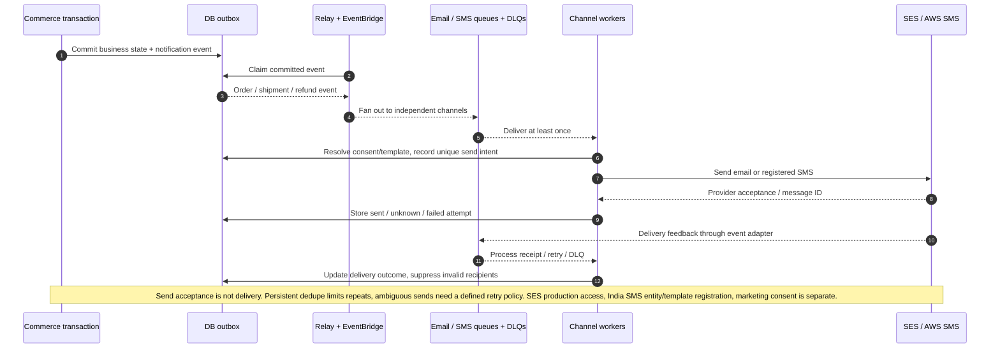
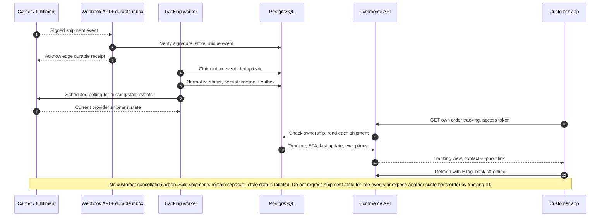
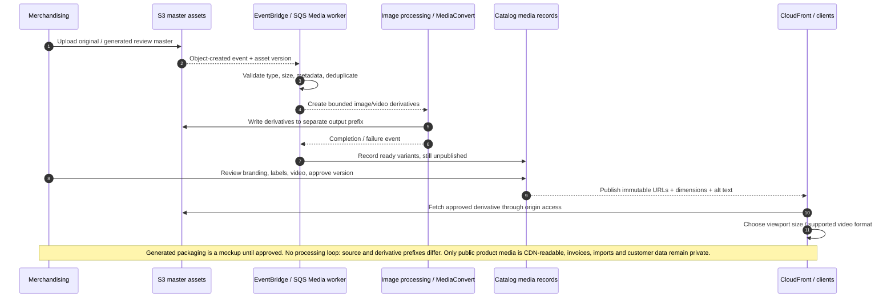

# Wellisha Sequence Diagrams

Generated from the same flow definitions as the draw.io pages. Each diagram shows the main flow; its notes and the design document define failure handling and conditional outcomes. Customers can track deliveries and contact support; cancellation execution is agent-only.

## 02  Federated Login

Common identity for web, Android and iOS | Public mobile client uses PKCE; web uses a session BFF

## 03  Catalog and Price Publication

Database commit precedes cache publication | Outbox + at-least-once processing | Versioned releases

## 04  Checkout, Payment and Fulfillment

Customers pay on Wellisha | Captured payment evidence drives order confirmation | External outcomes may be pending

## 05  Agent Cancellation and Refund

Customers contact support; only authorized agents can cancel | Backend RBAC enforces the restriction

## 06  Asynchronous Email and SMS

Notifications never block checkout or fulfillment | Separate channel queues and delivery tracking

## 07  Customer Delivery Tracking

One tracking experience across web, Android and iOS | Shipment-level timeline, ETA and last update

## 10  Product Media Publication

Approved product identity across web, Android and iOS | Originals preserved; delivery assets versioned

