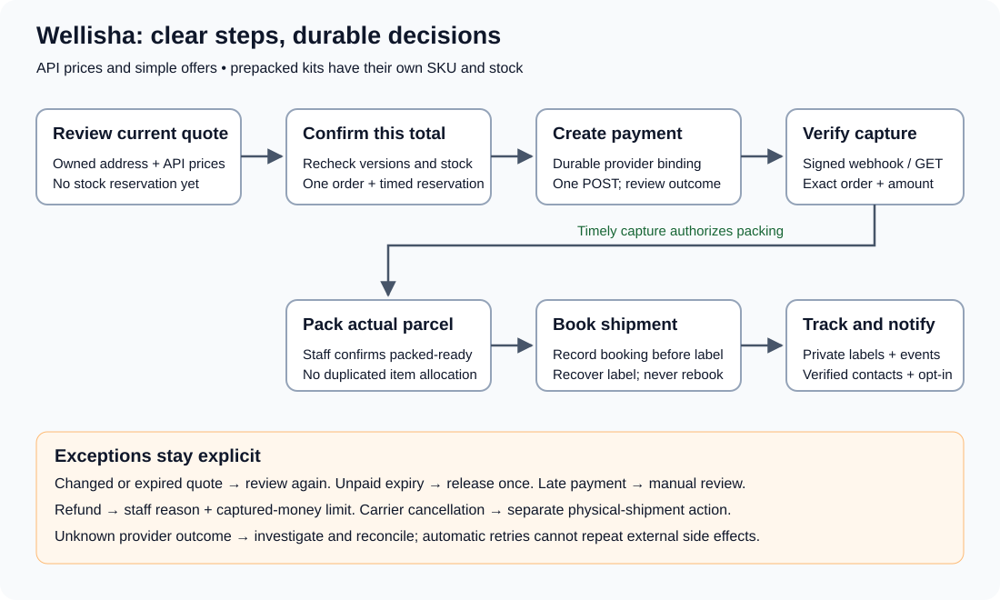

# Commerce lifecycle and operations

Updated October 6, 2026. This describes implemented code, with provider-account
acceptance still pending. The backend project is `wellisha-services`; the UI stays
in `storefront/` in the same repository. Separate API, worker and schema artifacts
can be released independently.

## Customer flow

1. Cognito signs the customer in. The web server holds the access token; the browser
   uses the same-origin BFF. Commerce mode uses Cognito without a Prisma adapter.
2. Product families expose independently priced and stocked variants. A prepacked
   kit is its own sellable SKU, with up to ten named components and its own stock.
   Kit assembly is an inventory operation before sale, not a checkout rule.
3. Catalog and cart refresh current API prices within 15 seconds while visible,
   and on focus/online. Hidden tabs pause. Errors show unavailable/stale data.
4. A quote snapshots address version, SKU versions, quantities and exact paise
   totals. It reserves no stock. The customer explicitly confirms the total.
5. Quote acceptance locks owned resources and sorted SKUs. Changed prices, kit
   contents, address, stock or expiry return 409 for a fresh review. One accepted
   quote and retry key create one immutable order and expiring reservation.
6. A worker stores CALLING before creating the Razorpay order. An owned READY
   provider binding enables the payment dialog. Browser success only shows pending.
7. Signed raw-body webhooks enter a durable inbox. Capture must match provider order,
   merchant account, amount and INR currency. Repeated captures do not pack twice.
8. Timely capture consumes the reservation and creates a packing task. Late capture
   goes to PAID_LATE_REVIEW without packing. Expiry releases stock exactly once;
   uncertain provider setup holds stock for reconciliation.

## Staff flow

Staff use `/staff/orders` and an individual order operations page. The API requires
both the relevant Cognito scope and a database issuer/subject permission grant.
UI visibility does not authorize an operation.

- Record actual parcel weight, dimensions and item quantities. Split parcels cannot
  allocate more units than the order. A captured order with held refunds cannot
  proceed to new packing/booking.
- Explicitly confirm packed-ready. The shipping worker obtains eligible India rates
  and selects the lowest permitted INR rate within the configured charge cap.
  Rates requiring additional inputs/services are held for operator review.
- Store the purchased provider shipment/tracking binding before saving its label.
  Document failures recover the label without purchasing another shipment. Labels
  remain private in encrypted S3; authorized links expire after 60 seconds.
- Poll stored tracking identifiers. Delayed older events do not regress current
  shipment state. Order summaries derive saved parcel allocations; a partial
  delivery never claims the entire order was delivered. Poll progress has its own
  timestamp and cannot reset cancellation recovery. Failing lookups rotate through
  bounded reconciliation batches so one job does not starve later work.
  Carrier cancellation is allowed before pickup and audited with
  version and reason; uncertain cancellation remains pending review.
- Request a bounded full/partial refund with a reason and retry key. All nonfailed
  refund requests, including UNKNOWN, count against captured funds. Provider
  confirmation controls completion. Refunds do not cancel parcels or return stock.

## Worker configuration and delivery

The worker artifact supports `WORKER_MODE=outbox-relay`, `payment`, `shipping`,
`refund`, `email` and `sms`. Each consumer receives only its own `QUEUE_URL_<MODE>`.
The outbox relay routes committed events to configured queues; aggregate state
provides duplicate-delivery protection. SQS retries/DLQs handle configuration and
transient failures. Media processing remains a separate scaffold.

Provider POSTs and SES/SNS sends are not automatically retried after an ambiguous
result. CALLING jobs abandoned by a crash become UNKNOWN. GET reconciliation binds
unique Razorpay receipts/refunds; missing or ambiguous matches require review.
Email/SMS uncertain outcomes require operator investigation before a new send.
Notifications use verified Cognito contacts and explicit opt-in. Opt-out/contact
changes prevent unsent queued deliveries. Payment capture, refund completion and
shipment state changes also appear in the owned in-app inbox.

## Recovery checklist

| State | Operator action | Never do |
| --- | --- | --- |
| Payment setup UNKNOWN | Match stored receipt, merchant, amount and INR against provider evidence; allow GET reconciliation | Blindly repeat order creation or release held stock |
| PAID_LATE_REVIEW | Review money and available stock; decide refund or controlled manual fulfillment | Dispatch automatically |
| Refund UNKNOWN | Match stored internal refund ID in provider notes, payment and amount; confirm status | Create another refund to replace an uncertain request |
| BOOKING_UNKNOWN | Investigate Amazon dashboard/account support and recorded parcel/rate evidence | Repeat purchase without proving no shipment exists |
| LABEL_PENDING | Recover documents for the stored shipment ID and save privately | Buy a replacement shipment |
| CANCEL_UNKNOWN | Confirm carrier status and pickup physically | Infer refund or inventory return |
| Notification UNKNOWN | Check delivery logs/provider message evidence | Automatically resend |
| Inbox MANUAL_REVIEW / DLQ | Correct configuration or investigate the specific safe event/job ID before replay | Clear records or expose raw credentials/customer payloads in logs |

Use a reviewed maintenance procedure for manual database transitions; there is no
unrestricted browser endpoint that overrides UNKNOWN. Preserve audit/evidence.

## Configuration and release evidence

Follow [provider setup](provider-setup.md) for account signup, secrets and task
configuration. Development policies are placeholders requiring commercial approval.
All CDK services default to zero tasks and checkout defaults to disabled. This
change does not deploy AWS, charge a customer or send a real notification.

Local verification covers PostgreSQL locking, schema repeatability, runtime role
restrictions, signed/duplicate events, late payment, refund bounds, parcel allocation,
document recovery, tracking ordering, opt-out, provider HTTP fixtures and browser
fixtures. It does not prove genuine Cognito signup, provider sandbox behavior,
physical label/pickup acceptance, production database grants or live delivery.
See [execution status](execution-status.md) for results and remaining gates.
