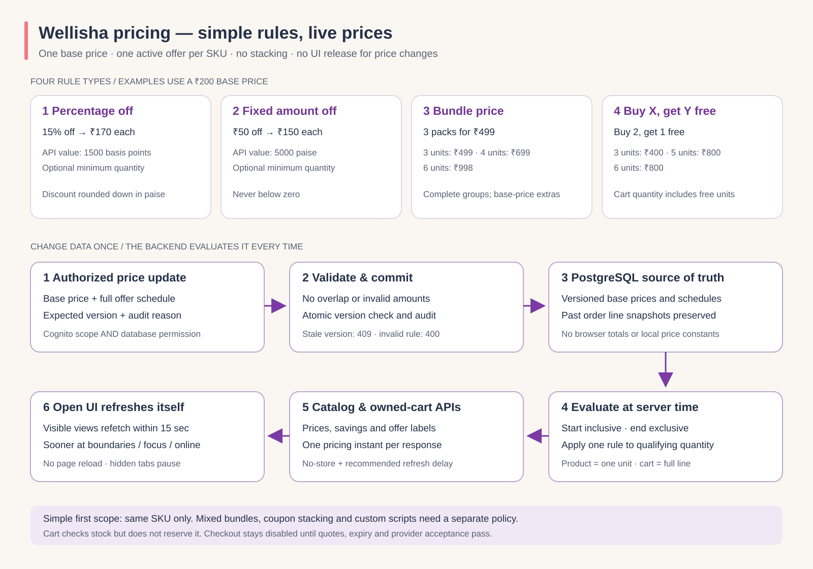

# API-controlled prices and offers

The Kotlin `wellisha-services` project owns prices and discounts. The storefront
displays API results and refreshes them automatically. Changing a price or offer
does not require a UI release. This is implemented for the commerce mode enabled
by `COMMERCE_API_URL`; the retained Prisma storefront is a separate compatibility
path. Checkout remains disabled pending its existing acceptance gates.



## Four understandable rules

Each sellable SKU has a base price in paise and a list of scheduled offers. One
offer may be active at a time. Offers never overlap or stack. All four types apply
to the same sellable SKU; there are no cross-SKU cart-matching offers, separate gifts,
customer segments, coupon codes, custom scripts or nested conditions.

Mixed-product bundles are supported as **prepacked kits** with their own SKU,
base price, offers and stocked quantity. The product detail lists up to ten
components. Assembly happens before sale; buying a kit reduces kit stock only.
Use `GET/PATCH /v1/admin/products/{id}/bundle` with `wellisha/catalog.write` plus
`catalog.bundle.write`, expected version, components and an audit reason. Contents
changes advance the SKU pricing version, retain offer schedules and invalidate old
quotes. Nested kits are rejected. This keeps the same four rules understandable.

The API also returns a generated `offerSummary` such as “3 for ₹499” or “Buy 2,
get 1 free. Add 3 units per group.” Marketing titles can change, but eligibility
text comes from the rule fields so customers can understand the calculation.

| Kind | Operator meaning | API fields | Example with base price ₹200 |
| --- | --- | --- | --- |
| `PERCENTAGE` | Percentage off each qualifying unit | `value` in basis points; `buyQuantity` minimum quantity | `value: 1500` is 15%; one costs ₹170 |
| `FIXED_AMOUNT` | Amount off each qualifying unit | `value` in paise; `buyQuantity` minimum quantity | `value: 5000` saves ₹50 per unit; one costs ₹150 |
| `BUNDLE_PRICE` | A complete group costs a fixed total | `buyQuantity` group size; `value` group total in paise | 3 for ₹499: 3 cost ₹499, 4 cost ₹699, 6 cost ₹998 |
| `BUY_X_GET_Y` | Free units in each complete group | `buyQuantity` paid units; `freeQuantity` free units; `value: 0` | Buy 2 get 1: 3 cost ₹400, 5 cost ₹800, 6 cost ₹800 |

Quantity includes free units: a buy-2-get-1 cart contains three units and stock
checks cover all three. No invisible gift lines are added. Incomplete groups use
the base price. A percentage/fixed rule with `buyQuantity: 3` starts applying to
the whole line at three units; below three the base price applies.

Percentage values are integer basis points: 100 is 1%, 1500 is 15%, and 10000 is
100%. Percentage discounts round down per unit to a whole paise, then multiply
by the line quantity. Monetary arithmetic uses checked
integers; totals and quantities never come from a browser-supplied price.
Base prices are bounded at 1,801,439,850,948 paise so even the maximum 50-SKU,
100-unit cart remains within TypeScript's exact safe-integer range.
The cart's server-returned line total and savings are authoritative; do not
recalculate quantity offers by multiplying the product card's single-unit price.

## Change a price or schedule

The API contract is [openapi.json](../../backend/contracts/openapi.json). Pricing
administration requires a genuine configured Cognito access token with
`wellisha/pricing.write` scope **and** the matching issuer/subject row with
`catalog.pricing.write` in the server-owned `commerce.staff_permission` table.
Permissions have no public grant endpoint and default to none. Production staff
MFA, permission grants and Cognito scope configuration remain deployment gates.
Existing NextAuth ADMIN roles do not grant this permission.

`GET /v1/admin/products/{id}/pricing` returns the current version, base price and
complete schedule, including future campaigns. It requires the same permission
as writes. Read this configuration before making a simple field change.

`PATCH /v1/admin/products/{id}/pricing` atomically replaces the base price and the
complete schedule. Send the current public `priceVersion` as `version`, and a
short reason for the audit record. Start/end timestamps are UTC instants with
inclusive start and exclusive end: `startsAt <= serverTime < endsAt`.

Example for Wellisha, not a claim of approved commercial prices:

```json
{
  "version": 0,
  "basePriceMinor": 20000,
  "offers": [
    {
      "title": "3 packs for ₹499",
      "kind": "BUNDLE_PRICE",
      "value": 49900,
      "buyQuantity": 3,
      "freeQuantity": 0,
      "startsAt": "2026-10-10T00:00:00Z",
      "endsAt": "2026-10-17T00:00:00Z"
    }
  ],
  "reason": "Approved October pack offer"
}
```

Change the four offer fields to switch rule type; add non-overlapping future
entries for later campaigns. Send `offers: []` to remove all current/future offers
while retaining the specified base price. Reverting a price creates another
version and audit entry. A stale version returns 409; reload the latest version
and review the change. Invalid schedules or discounts fail without partially
updating the product. Offer titles must describe the configured rule truthfully.
`priceVersion` tracks configuration edits, not the passage of time. A scheduled
start/end can change the effective price without changing its version; clients
must refetch values even when the configuration version is unchanged.

## Read, refresh and checkout boundaries

- Public category, paged catalog and detail APIs return effective prices,
  base price, single-unit discount, active offer title and price version.
- Catalog pages support bounded search/category filters and effective single-unit
  price sorting. A SKU represents one pack/variant in this slice. Offset pages can
  shift during edits; grouping variants under parent products remains future work.
- API responses use `no-store`. Each response prices its data at one database
  instant and returns `pricedAt` plus a bounded `refreshAfterMs`.
- Visible home, collection, product and cart views refetch at most every 15 seconds,
  sooner near the next scheduled offer boundary. Returning to a tab or coming
  back online triggers another fetch. There is no full-page reload or manual
  refresh requirement during normal network operation. Hidden tabs pause polling.
  The delay applies between completed requests; network latency can extend the
  observed update time. This is bounded polling, not an instantaneous push feed.
- The header's promotional strip reads active offer titles. It does not continue
  displaying a hard-coded coupon in commerce mode. An outage shows an error;
  cached values are not evidence that an expired offer is still valid.
- Cart items belong to the authenticated customer, have quantities 1–100 and
  at most 50 different SKUs. Stock is checked but not reserved by cart operations.
  A read recalculates bundle/free-unit savings from current API rules.
- The disabled order implementation uses the same evaluator, locks requested
  products, and stores base price, discount, version and offer title on order lines.
  Later price edits cannot rewrite an existing order. Accepted/expiring quotes and
  customer confirmation of changed prices must be completed before checkout opens.
- Optional future cache/SSE publication must retain this database source of truth
  and bounded refresh fallback. No catalog event is sent to the existing payment
  outbox queues; live cache publication is a separate work package.

## Acceptance evidence to maintain

`PricingRulesTest` covers thresholds, rounding, complete groups, leftovers,
invalid values and adjacent/overlapping schedules. `CatalogPricingPostgresTest`
checks public filtering/sorting, both pricing permissions, stale/concurrent
updates, atomic audit records, cart ownership, current repricing, expiry/start
boundaries, unavailable stock and immutable order prices. Storefront validators
reject unsafe integer money and inconsistent server totals. Browser acceptance
must prove that an already-open page updates after a backend price change while
preserving cart quantities and remaining within the refresh interval.

See [agent guidance](../../.agents/pricing-rules.md) and
[implementation status](execution-status.md) for recorded execution results.
